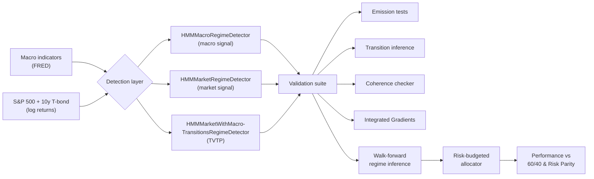

# Equity–Bond Correlation under Macroeconomic Regimes

**A regime detection, diagnostics, and allocation framework — 1970–2025**

[](https://www.python.org/downloads/)
[](https://jupyter.org/)
[](https://colab.research.google.com/github/EnsaeStatApp/CorrelationEquityBond)
[]()
[]()

> The sign and magnitude of the equity–bond correlation are not constant: they regime-switch in response to macroeconomic conditions. This project builds an end-to-end framework — from Hidden Markov regime detection to risk-budgeted asset allocation — to identify, characterize, and exploit those regimes over the 1970–2025 period.

---

## Table of Contents

- [Research Question](#research-question)
- [Methodological Architecture](#methodological-architecture)
- [Three HMM Variants](#three-hmm-variants)
- [Repository Structure](#repository-structure)
- [Module Reference](#module-reference)
- [Data](#data)
- [Installation](#installation)
- [Usage](#usage)
- [Validation Framework](#validation-framework)
- [Allocation Strategy](#allocation-strategy)
- [Key Results](#key-results)
- [Roadmap](#roadmap)
- [Bibliography](#bibliography)
- [Authors](#authors)
- [License](#license)

---

## Research Question

> **What macroeconomic conditions drive the sign of the equity–bond correlation, can these conditions be identified ex-ante from observable economic data, and does conditioning portfolio allocation on regime probabilities deliver superior risk-adjusted performance?**

The project answers this in three stages:

1. **Detection.** Fit Hidden Markov Models on macro and/or financial data to extract latent economic regimes.
2. **Diagnostics.** Validate the model with a four-pillar coherence framework (separability, stability, persistence, confidence) and attribute regime transitions to specific macro drivers via Integrated Gradients.
3. **Allocation.** Translate regime probabilities into a risk-budgeted, regime-aware portfolio and benchmark it against 60/40 and rolling Risk Parity.

## Methodological Architecture



## Three HMM Variants

The framework implements three complementary regime detectors, each with a distinct economic reading:

| Detector | Observed signal | Transition matrix | Use case |
|---|---|---|---|
| **`HMMMacroRegimeDetector`** | Macroeconomic indicators | Sticky (constant) | Identify *macroeconomic* regimes; characterize asset behavior conditional on macro state |
| **`HMMMarketRegimeDetector`** | Asset log returns | Sticky (constant) | Identify *market* regimes from returns alone; baseline financial HMM |
| **`HMMMarketWithMacroTransitionsRegimeDetector`** | Asset log returns | Input-driven by macro covariates (TVTP) | Market emissions with macro-conditional transition probabilities; bridges the two views |

The third variant (TVTP — Time-Varying Transition Probabilities) is initialized via a two-step warm start: a stationary HMM provides emission parameters, and a multinomial logistic regression on the Viterbi path provides transition weights. This significantly improves convergence on the EM step.

All three variants inherit from a common `BaseRegimeDetector` interface, ensuring a stable API for downstream diagnostics and strategy components.

## Repository Structure

```
CorrelationEquityBond/
│
├── data/
│   └── dataset.csv                      # Monthly macro + financial dataset (1970–2025)
│
├── notebooks/
│   └── 01_Descriptive_Research/
│       ├── HMM_Macro_Regime_Analysis.ipynb                      # Macro-only HMM
│       ├── HMM_InSample_Regime_Analysis_EquityBond.ipynb        # Market-only HMM
│       └── HMMTVTP_InSample_Regime_Analysis_EquityBond.ipynb    # TVTP HMM
│
├── src/stock_bond_correlation/
│   │
│   ├── models/
│   │   ├── base.py                                              # Abstract RegimeDetector interface
│   │   ├── base_detector.py                                     # Shared SSM logic (filtering, conditional cov, entropy)
│   │   ├── HMMMacroRegimeDetector.py                            # Variant 1
│   │   ├── HMMMarketRegimeDetector.py                           # Variant 2
│   │   └── HMMMarketWithMacroTransitionsRegimeDetector.py       # Variant 3 (TVTP)
│   │
│   ├── diagnostics/
│   │   ├── statistical_tests/
│   │   │   ├── EmissionStatisticalAnalyzer.py                   # Levene, Fisher-Z, bootstrap CIs
│   │   │   ├── TransitionStatisticalAnalyzer.py                 # Hessian-based standard errors
│   │   │   └── HMMCoherenceChecker.py                           # Four-pillar validation
│   │   └── explainability_ig/
│   │       └── TransitionExplainer.py                           # Integrated Gradients on TVTP
│   │
│   ├── walk_forward_regime_inference/
│   │   └── GenericHMMBacktester.py                              # Walk-forward regime inference
│   │
│   ├── strategy/
│   │   ├── allocator/
│   │   │   └── RiskBudgetingAllocator.py                        # Spinu log-utility risk budgeting
│   │   ├── strategy_backtest/
│   │   │   └── StrategySimulator.py                             # Regime-aware portfolio simulator
│   │   └── utils/
│   │       └── performance.py                                   # Sharpe, MDD, Calmar, net returns
│   │
│   └── visualization/
│       ├── RegimeReporter.py                                    # Wealth & implied correlation plots
│       └── performance_reporter.py                              # Strategy reporting
│
├── papers/                              # Literature references (see Bibliography)
│
├── requirements.txt
└── README.md
```

## Module Reference

### Models (`src/.../models/`)

| File | Role |
|---|---|
| `base.py` | Abstract `RegimeDetector` class enforcing the API across all variants (fit, regime_probabilities, conditional_covariance, predict_probabilities, …). |
| `base_detector.py` | Shared SSM-level implementation: total conditional covariance via the law of total covariance, regime correlations, Shannon-entropy confidence index, transition matrix retrieval. |
| `HMMMacroRegimeDetector.py` | HMM fitted on standardized macro indicators; financial assets characterized a posteriori. |
| `HMMMarketRegimeDetector.py` | Sticky HMM fitted directly on asset log returns. |
| `HMMMarketWithMacroTransitionsRegimeDetector.py` | Input-Driven HMM (TVTP) with macro-conditional transitions and a two-stage warm-start initialization. |

### Diagnostics (`src/.../diagnostics/`)

| File | Role |
|---|---|
| `EmissionStatisticalAnalyzer.py` | Pairwise Levene tests (volatility), Fisher-Z tests (correlation) with Bonferroni / FDR correction, and 5 000-resample non-parametric bootstrap confidence intervals. |
| `TransitionStatisticalAnalyzer.py` | Numerical Hessian of the transition log-likelihood → Fisher information → standard errors, p-values, condition number, expected durations, stationary distribution. |
| `HMMCoherenceChecker.py` | Orchestrates a four-pillar validation: separability ratio, numerical stability, minimum persistence, average Viterbi confidence. Outputs a weighted coherence score. |
| `TransitionExplainer.py` | **Integrated Gradients** attribution: decomposes any transition probability shift between two dates into per-covariate contributions — interpretable even out of the training set. |

### Strategy (`src/.../strategy/`)

| File | Role |
|---|---|
| `RiskBudgetingAllocator.py` | Risk-budgeted weights via Spinu's log-utility convex formulation; solved with `L-BFGS-B`. |
| `StrategySimulator.py` | Regime-aware backtester: detects the *stress regime* (positive equity–bond correlation + high 60/40 vol), tilts the risk budget away from equities under stress, applies vol-targeting with a leverage cap, and accounts for transaction and financing costs. |
| `performance.py` | Net-return calculation (post turnover and borrow costs) and standard performance metrics (annualized return, vol, Sharpe, max drawdown, Calmar). |

## Data

Monthly observations from January 1970 to January 2025.

### Macroeconomic features (FRED)

| Variable | Ticker | Treatment |
|---|---|---|
| Industrial Production | `INDPRO` | YoY change |
| Producer Price Index — All Commodities | `PPIACO` | YoY change |
| Capacity Utilization | `TCU` | YoY change |
| Unemployment Rate | `UNRATE` | YoY change |
| Consumer Price Index | `CPI` | YoY change |
| Univ. of Michigan Consumer Sentiment | `UMCSENT` | Level |
| 3-Month Treasury Bill rate | `TB3MS` | Level |

All macro features are standardized (zero mean, unit variance) before being passed to the HMM.

### Financial assets

- **S&P 500** — total return index (log returns)
- **10-year U.S. Treasury** — total return index (log returns)

## Installation

### Prerequisites

- Python ≥ 3.10
- `pip`, `git`

### Local installation

```bash
git clone https://github.com/EnsaeStatApp/CorrelationEquityBond.git
cd CorrelationEquityBond
pip install -r requirements.txt
pip install git+https://github.com/lindermanlab/ssm.git
```

> **Note.** The [`ssm`](https://github.com/lindermanlab/ssm) library (Linderman Lab, Stanford) is not on PyPI and must be installed directly from GitHub. It powers all underlying HMM machinery.

The package follows a `src/` layout. Once installed (or with the repository root on `PYTHONPATH`), modules are imported as:

```python
from src.stock_bond_correlation.models.HMMMacroRegimeDetector import HMMMacroRegimeDetector
from src.stock_bond_correlation.diagnostics.statistical_tests.HMMCoherenceChecker import HMMCoherenceChecker
from src.stock_bond_correlation.strategy.strategy_backtest.StrategySimulator import StrategySimulator
```

### Google Colab

Each notebook ships with a Colab badge for one-click execution. The first cell handles repository cloning, dependency installation, and environment setup automatically — no local Python configuration is required.

## Usage

The three notebooks in `notebooks/01_Descriptive_Research/` correspond one-for-one to the three HMM variants.

### 1. Macro-only HMM — `HMM_Macro_Regime_Analysis.ipynb`

Identifies macroeconomic regimes from real economic indicators, then characterizes financial behavior conditional on the detected states.

```python
from src.stock_bond_correlation.models.HMMMacroRegimeDetector import HMMMacroRegimeDetector
from src.stock_bond_correlation.diagnostics.statistical_tests.HMMCoherenceChecker import HMMCoherenceChecker

detector = HMMMacroRegimeDetector(n_regimes=3, transition_kwargs={"kappa": 10, "alpha": 2})
detector.fit(observations=[X_macro_scaled], log_returns=[Y_financial])

checker = HMMCoherenceChecker(
    detector=detector,
    log_returns=Y_financial,
    asset_names=["S&P500", "T-bond 10y"]
)
checker.report_emission_stats()
checker.report_transition_stats()
checker.final_verdict()
```

### 2. Market-only HMM — `HMM_InSample_Regime_Analysis_EquityBond.ipynb`

Baseline sticky HMM fitted directly on log returns. Useful for benchmarking against the macro-driven variants.

### 3. TVTP HMM — `HMMTVTP_InSample_Regime_Analysis_EquityBond.ipynb`

Market emissions with macro-conditional transitions, plus *Integrated Gradients* explanations of regime shifts:

```python
from src.stock_bond_correlation.models.HMMMarketWithMacroTransitionsRegimeDetector \
    import HMMMarketWithMacroTransitionsRegimeDetector
from src.stock_bond_correlation.diagnostics.explainability_ig.TransitionExplainer \
    import TransitionExplainer

detector = HMMMarketWithMacroTransitionsRegimeDetector(n_regimes=3, n_dim=2, n_input=7)
detector.fit(observations=[Y_returns], inputs=[X_macro_lagged], warm_start=True)

explainer = TransitionExplainer(detector, feature_names=MACRO_NAMES)
attributions = explainer.explain_delta(X_t, X_tp1, from_state=1, to_state=0)
explainer.plot_explanation(attributions, from_regime=1, to_regime=0,
                           date_label="2008-09", from_regime_name="Normal",
                           to_regime_name="Equity stress")
```

## Validation Framework

The `HMMCoherenceChecker` enforces a **four-pillar validation protocol**. A model is *validated* only when all four criteria are met simultaneously.

| Pillar | Test | Default threshold |
|---|---|---|
| **Separability** | Levene (vol) + Fisher-Z (corr), Bonferroni-adjusted | ≥ 45 % significant tests |
| **Numerical stability** | Condition number of observed Fisher information | < 10⁸ |
| **Persistence** | Minimum average regime duration | ≥ 3 months |
| **Confidence** | Average Viterbi posterior 1 − entropy | ≥ 70 % |

Each statistic is reported with bootstrap 95 % confidence intervals (5 000 resamples). The checker outputs a single weighted coherence score for cross-model comparison:

$$
\text{score} = 0.30 \cdot s_{\text{sep}} + 0.20 \cdot s_{\text{stab}} + 0.20 \cdot s_{\text{pers}} + 0.30 \cdot s_{\text{conf}}
$$

Standard errors on transition parameters are obtained from a **second-order finite-difference Hessian** of the log-likelihood, recentered around the reference regime to handle the softmax identifiability constraint. Eigenvalue analysis of the observed Fisher information also surfaces parameters lying on the boundary of the parameter space (e.g. constrained transitions with `Std_Err ≈ 0`).

## Allocation Strategy

The `StrategySimulator` translates regime probabilities into monthly portfolio weights through a layered decision logic:

1. **Stress regime detection.** At each date, the regime with the highest *danger score* (positive equity–bond correlation × high 60/40 volatility) is flagged as the stress state.
2. **Dynamic risk budget.** For each regime, the equity risk budget shrinks linearly with the danger score: $b_{\text{SP}} = b_{\max} - \text{danger} \cdot (b_{\max} - b_{\min})$.
3. **Risk-budgeting weights.** Solved per regime via Spinu's convex log-utility formulation (see `RiskBudgetingAllocator`).
4. **Volatility targeting.** Per-regime leverage hits a target volatility, capped by `max_leverage`. In the stress regime, leverage is further capped between `lev_normal` and `lev_min_stress`.
5. **Probability blending.** Final weights are the regime-probability-weighted average of per-regime allocations.
6. **Cost accounting.** Net returns include turnover-based transaction costs and borrow spreads on leveraged positions; cash earns the contemporaneous T-bill rate.

The simulator outputs four return series for direct comparison:

- **Strategy** — full regime-aware allocation with leverage and costs
- **Strategy (pure)** — same regime-conditional weights, no leverage, no costs
- **60/40** — static benchmark
- **Rolling Risk Parity** — rolling 12-month covariance, equal risk contribution

Performance metrics (annualized return, volatility, Sharpe, max drawdown, Calmar) are computed in `strategy/utils/performance.py`.

## Key Results

The macro-only HMM identifies three economically interpretable regimes over 1970–2025:

| Regime | Label | Avg. duration | Long-run frequency | S&P 500 vol | T-bond 10y vol | S&P/T-bond corr. |
|---|---|---|---|---|---|---|
| **R0** | Equity stress / flight-to-quality | 37.4 months | 19.4 % | 18.1 % | 7.6 % | **−0.35** |
| **R1** | Normal | 93.4 months | 64.5 % | 10.0 % | 6.1 % | +0.07 |
| **R2** | Inflationary stress | 46.5 months | 16.1 % | 14.1 % | 9.4 % | **+0.34** |

**Headlines**

- The **sign** of the equity–bond correlation flips between regimes: strongly negative under flight-to-quality, near zero in normal times, significantly positive under inflationary stress.
- The R0 / R2 distinction rests **entirely on correlation structure**, not on variance levels — Levene tests on volatility cannot separate them, while Fisher-Z tests on correlation can. This justifies a multivariate model over univariate volatility switching.
- The model achieves an overall coherence score of **83.1 %**, validated on all four pillars.

See `notebooks/01_Descriptive_Research/` for the full analyses.

## Roadmap

The project is organized in incremental research stages:

- [x] **`01_Descriptive_Research`** — In-sample regime detection and characterization across the three HMM variants
- [ ] **`02_OutOfSample_Validation`** — Walk-forward regime probabilities via `GenericHMMBacktester`, stability of the macro-driver attribution
- [ ] **`03_Strategy_Backtest`** — Full strategy backtest with `StrategySimulator`, sensitivity to target vol / risk budget bounds / smoothing
- [ ] **`04_Robustness`** — Crisis-by-crisis stress tests (Volcker, GFC, COVID, 2022 inflation shock), out-of-sample stability of regime labels

## Bibliography

The `papers/` directory contains the academic and industry literature underpinning this project:

- **Stock–bond correlation dynamics**
  - *The Stock–Bond Correlation* — Journal of Portfolio Management, February 2021
  - *A Changing Stock–Bond Correlation: Drivers and Implications* — Journal of Portfolio Management, March 2023
- **Inflation and macro drivers**
  - *Inflation Replication Portfolio* — HSBC, December 2019
- **Volatility and correlation estimation**
  - *Calculate Historical Volatilities and Correlations: Methods Comparison* — HSBC, January 2025
- **Autocorrelation and risk underestimation**
  - Petreski, M. (2007). *Hedge Funds: Influence of Autocorrelation on Risk Underestimation*
  - *It's the Autocorrelation, Stupid* — Alternative Edge, November 2012
- **Project report**
  - *Analyse de changement de régime — Corrélation entre indices Action et Obligataire*

### Software

- Linderman, S. et al. **SSM: Bayesian Learning and Inference for State Space Models.** [github.com/lindermanlab/ssm](https://github.com/lindermanlab/ssm)
- Sundararajan, M., Taly, A., & Yan, Q. (2017). *Axiomatic Attribution for Deep Networks* — basis for the Integrated Gradients implementation in `TransitionExplainer`.
- Spinu, F. (2013). *An Algorithm for Computing Risk Parity Weights* — basis for `RiskBudgetingAllocator`.

### Data

- Federal Reserve Bank of St. Louis. **FRED Economic Data.** [fred.stlouisfed.org](https://fred.stlouisfed.org)

## Authors

ENSAE — Statistical Applications team
[github.com/EnsaeStatApp](https://github.com/EnsaeStatApp)

For questions, suggestions, or contributions, please open an issue on the repository.

## License

This project is released for academic and research purposes. Please refer to the `LICENSE` file for full usage terms.

---

<sub>Last updated — May 2026</sub>
