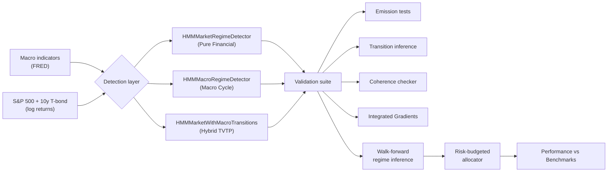

# Macro-Conditional Market Regimes and the Dynamics of Stock–Bond Correlation

**A regime detection, diagnostics, and allocation framework — 1970–2025**

[](https://www.python.org/downloads/)
[](https://jupyter.org/)
[](https://colab.research.google.com/github/EnsaeStatApp/CorrelationEquityBond)
[]()
[]()

> The sign and magnitude of the equity–bond correlation are not constant: they regime-switch in response to macroeconomic conditions. This project builds an end-to-end framework — from Hidden Markov regime detection to risk-budgeted asset allocation — to identify, characterize, and exploit those regimes over the 1970–2025 period.

---

## Table of Contents

- [Research Question](#research-question)
- [Methodological Architecture](#methodological-architecture)
- [Three HMM Perspectives](#three-hmm-perspectives)
- [Repository Structure](#repository-structure)
- [Module Reference](#module-reference)
- [Data](#data)
- [Installation](#installation)
- [Roadmap](#roadmap)
- [Validation Framework](#validation-framework)
- [Allocation Strategy](#allocation-strategy)
- [Historical Performance Comparison (1995–2025)](#historical-performance-comparison-1995-2025)
- [Bibliography](#bibliography)
- [Authors](#authors)
- [Acknowledgements](#acknowledgements)
- [License](#license)

---

## Research Question

> **Can we identify statistically robust latent regimes in stock–bond dynamics, and to what extent are their transitions driven by macroeconomic conditions? Finally, can this dual financial-macro understanding be exploited to outperform static benchmarks?**

The project answers this in three stages:

1. **Detection.** Fit Hidden Markov Models on financial and macro data to extract latent regimes.
2. **Diagnostics.** Validate the 4-regime structure via a four-pillar coherence framework and attribute transitions to macro drivers using **Integrated Gradients**.
3. **Allocation.** Translate regime probabilities into a risk-budgeted, proactive portfolio strategy.

## Methodological Architecture



## Three HMM Perspectives

The framework implements three complementary detectors to analyze the stock-bond relationship through different lenses:

| Detector | Observed signal | Transition logic | Purpose |
| --- | --- | --- | --- |
| **`HMMMarketRegimeDetector`** | Asset log returns | Constant (Sticky) | **Pure Financial Lens**: Identifies the 4 fundamental regimes of diversification directly from price action. Our statistical ground truth. |
| **`HMMMacroRegimeDetector`** | Macro indicators | Constant (Sticky) | **Economic Cycle Lens**: Characterizes how financial assets behave conditional on structural economic phases (Inflation, Growth). |
| **`HMMMarketWithMacroTransitions`** | Asset log returns | Input-driven (TVTP) | **The Hybrid Engine**: Uses macro covariates to anticipate regime shifts *before* they materialize in returns. |

## Repository Structure

```
CorrelationEquityBond/
│
├── data/
│   └── dataset.csv                      # Monthly macro + financial dataset (1970–2025)
│
├── notebooks/
│   ├── 01_Descriptive_Research/         # Calibration & In-Sample Analysis
│   │   ├── 01_HMM_Market_InSample.ipynb
│   │   ├── 02_HMM_Macro_InSample.ipynb
│   │   └── 03_HMMTVTP_Hybrid_InSample.ipynb
│   │
│   └── 02_WalkForward_Simulation/       # Proactive Trading Strategy
│       └── 04_WalkForward_Backtest_and_Explainability.ipynb
│
├── src/stock_bond_correlation/
│   ├── models/                          # HMM Architecture (Market, Macro, TVTP)
│   ├── diagnostics/                     # Coherence, Stats & Integrated Gradients
│   ├── backtest/                        # Walk-forward inference engine
│   ├── strategy/                        # Risk Budgeting & Performance metrics
│   └── visualization/                   # Regime Reporting & Equity curves
│
├── requirements.txt
└── README.md

```

## Module Reference

### Models (`src/.../models/`)

* `HMMMarketRegimeDetector.py`: Baseline model identifying regimes from returns alone.
* `HMMMarketWithMacroTransitionsRegimeDetector.py`: **The Core Innovation**. An Input-Driven HMM (TVTP) that bridges the gap between macro-economic cycles and financial market reactions.

### Diagnostics (`src/.../diagnostics/`)

* `HMMCoherenceChecker.py`: Orchestrates a four-pillar validation (Separability, Stability, Persistence, Confidence). Overall coherence score: **83.1%**.
* `TransitionExplainer.py`: **Integrated Gradients (IG)**. Decomposes any transition probability shift into per-covariate macro-contributions (e.g., Inflation, Slope).

### Strategy (`src/.../strategy/`)

* `RiskBudgetingAllocator.py`: Solves Spinu's log-utility convex formulation for optimal regime-aware weights.
* `StrategySimulator.py`: Applies volatility targeting, leverage caps, and stress-regime overlays (where equity risk budget shrinks during inflationary stress).

## Validation Framework

We enforce a **four-pillar validation protocol**:

1. **Separability**: Levene (vol) + Fisher-Z (corr) tests to ensure regimes are statistically distinct.
2. **Numerical stability**: Condition number of the observed Fisher information.
3. **Persistence**: Average regime duration (must be > 3 months).
4. **Confidence**: Average Viterbi posterior certainty (1 - Entropy).

The final coherence score is calculated as follows:


$$ \text{score} = 0.30 \cdot s_{\text{sep}} + 0.20 \cdot s_{\text{stab}} + 0.20 \cdot s_{\text{pers}} + 0.30 \cdot s_{\text{conf}} $$

## Allocation Strategy

The `StrategySimulator` translates regime probabilities into monthly portfolio weights through a layered decision logic:

1. **Stress regime detection.** Identification of the state with positive stock-bond correlation and high volatility.
2. **Dynamic risk budget.** The equity risk budget shrinks linearly as the danger score of the current regime increases.
3. **Volatility targeting.** Per-regime leverage adjusted to hit target volatility, with specific caps for stress periods.
4. **Probability blending.** Final weights are calculated as the regime-probability-weighted average of per-regime allocations.

## Historical Performance Comparison (1995–2025)

| **Metric** | **HMM TVTP (Strategy)** | **Rolling Risk Parity** | **Benchmark 60/40** |
| --- | --- | --- | --- |
| **Annual Return** | **9.26%** | 7.04% | 8.68% |
| **Annual Volatility** | **6.22%** | 5.64% | 7.67% |
| **Net Sharpe Ratio** | **1.08** | 0.82 | 0.81 |
| **Maximum Drawdown** | **-11.04%** | -19.13% | -27.00% |
| **Calmar Ratio** | **0.83** | 0.37 | 0.32 |

## Installation

```bash
git clone [https://github.com/EnsaeStatApp/CorrelationEquityBond.git](https://github.com/EnsaeStatApp/CorrelationEquityBond.git)
cd CorrelationEquityBond
pip install -r requirements.txt
pip install git+[https://github.com/lindermanlab/ssm.git](https://github.com/lindermanlab/ssm.git)

```

## Roadmap

The project is organized in incremental research stages:

* [x] **`01_Descriptive_Research`** — In-sample regime detection and characterization across the three HMM variants.
* [ ] **`02_OutOfSample_Validation`** — Walk-forward regime probabilities via `GenericHMMBacktester`, stability of the macro-driver attribution.
* [ ] **`03_Strategy_Backtest`** — Full strategy backtest with `StrategySimulator`, sensitivity to target vol / risk budget bounds / smoothing.
* [ ] **`04_Robustness`** — Crisis-by-crisis stress tests (Volcker, GFC, COVID, 2022 inflation shock), out-of-sample stability of regime labels.

## Bibliography

### 1. Dynamics of Stock–Bond Correlation

* **ASNESS, C., et al. (2021).** *The Stock–Bond Correlation.* Journal of Portfolio Management.
* **HSBC Global Research (2023).** *A Changing Stock–Bond Correlation: Drivers and Implications.*
* **ILMANEN, A. (2003).** *Stock-Bond Correlations.* Journal of Fixed Income.

### 2. Regime-Switching Models (HMM)

* **HAMILTON, J. D. (1989).** *A New Approach to the Economic Analysis of Nonstationary Time Series and the Business Cycle.* Econometrica.
* **ANG, A., & BEKAERT, G. (2002).** *International Asset Allocation with Regime Shifts.* Review of Financial Studies.
* **DIEBOLD, F. X., et al. (1994).** *Regime Switching with Time-Varying Transition Probabilities.*

### 3. Explainability & Attribution

* **SUNDARARAJAN, M., et al. (2017).** *Axiomatic Attribution for Deep Networks.* ICML.
* **SHAPLEY, L. S. (1953).** *A Value for n-person Games.*

### 4. Portfolio Engineering & Risk Budgeting

* **SPINU, F. (2013).** *An Algorithm for Computing Risk Parity Weights.*
* **MAILLARD, S., et al. (2010).** *The Properties of Equally Weighted Risk Contribution Portfolios.* Journal of Portfolio Management.

### 5. Technical Documentation & Data

* **LINDERMAN, S., et al.** *SSM: Bayesian Learning and Inference for State Space Models.* [GitHub](https://github.com/lindermanlab/ssm).
* **Federal Reserve Bank of St. Louis.** *FRED Economic Data.* [fred.stlouisfed.org](https://fred.stlouisfed.org).

### Software

* Linderman, S. et al. **SSM: Bayesian Learning and Inference for State Space Models.** [github.com/lindermanlab/ssm](https://github.com/lindermanlab/ssm)
* Sundararajan, M., Taly, A., & Yan, Q. (2017). *Axiomatic Attribution for Deep Networks* — basis for the Integrated Gradients implementation in `TransitionExplainer`.
* Spinu, F. (2013). *An Algorithm for Computing Risk Parity Weights* — basis for `RiskBudgetingAllocator`.

### Data

* Federal Reserve Bank of St. Louis. **FRED Economic Data.** [fred.stlouisfed.org](https://fred.stlouisfed.org)
* Online Data: U.S. Stock Price, Earnings, and Dividends (since 1871). [econ.yale.edu](http://www.econ.yale.edu/~shiller/data.htm)

## Authors

**ENSAE — Statistical Applications Team**

* Benjamin Benisti
* Imade Haddadi
* Marie-Camille Memet
* Aurèle Thinot

## Acknowledgements

We would like to thank **Loïc Brach** (HSBC) for his supervision and guidance throughout this project.

## License

This project is released for academic and research purposes. Please refer to the `LICENSE` file for full usage terms.

